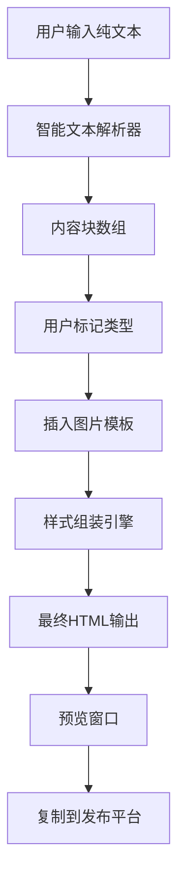

# 版式装配引擎 V1.0

一款高速版式装配引擎，能将无格式的纯文本，一键转化为视觉统一、可直接用于发布平台的HTML代码。

## 🚀 特性

- **智能文本解析** - 自动清理格式并智能分割内容块
- **可视化编辑** - 幕布式工作区，直观的内容类型标记
- **一键生成** - 基于模板的样式应用，输出即用型HTML
- **实时预览** - iframe预览窗口，所见即所得
- **复制即用** - 直接复制HTML代码到135编辑器等平台

## 🛠 技术架构

### 前端技术栈
- **Vue 3** - 渐进式JavaScript框架
- **Pinia** - Vue状态管理库
- **TailwindCSS** - 实用优先的CSS框架
- **Vite** - 快速的构建工具

### 架构设计

```
src/
├── components/           # Vue组件
│   ├── Step1TextInput.vue   # 步骤1：文本输入
│   ├── Step2Curtain.vue     # 步骤2：内容编辑
│   ├── Step3Preview.vue     # 步骤3：预览生成
│   ├── FloatingToolbar.vue  # 浮动工具栏
│   └── LayoutInserter.vue   # 版式插入器
├── stores/              # Pinia状态管理
│   └── appStore.js          # 应用主状态
├── utils/               # 工具函数
│   ├── textParser.js        # 智能文本解析器
│   └── styleAssembler.js    # 样式组装引擎
├── styles/              # 样式模板
│   └── templates.js         # HTML样式模板
├── App.vue              # 根组件
└── main.js              # 应用入口
```

## 📦 安装和运行

### 环境要求
- Node.js 16.0+
- npm 或 yarn

### 安装依赖

```bash
npm install
```

### 开发模式

```bash
npm run dev
```

应用将在 `http://localhost:3000` 启动

### 构建生产版本

```bash
npm run build
```

### 预览生产版本

```bash
npm run preview
```

## 🎯 使用流程

### 步骤1：输入文本
1. 粘贴大段纯文本到输入区域
2. 系统自动清理多余空格和空行
3. 点击"下一步"进入编辑模式

### 步骤2：编辑内容
1. 查看自动分割的内容块
2. 点击文本块，使用浮动工具栏设置类型：
   - 引言 - 文章开头或结尾的特殊内容
   - 小标题 - 章节标题
   - 正文 - 普通段落内容
   - 结尾 - 文章总结部分
3. 使用[+]按钮插入图片模板：
   - 单图模板
   - 双图模板
4. 点击"下一步"生成样式

### 步骤3：预览和复制
1. 查看实时预览效果
2. 切换到HTML代码模式
3. 点击"复制HTML代码"
4. 粘贴到135编辑器等发布平台

## 🔧 自定义配置

### 修改样式模板

编辑 `src/styles/templates.js` 文件来自定义样式：

```javascript
export const STYLE_TEMPLATES = {
  intro_outro: `<!-- 引言/结尾样式 -->`,
  title: `<!-- 小标题样式 -->`,
  body: `<!-- 正文样式 -->`
}

export const IMAGE_TEMPLATES = {
  single: `<!-- 单图模板 -->`,
  double: `<!-- 双图模板 -->`
}
```

### 文本解析规则

在 `src/utils/textParser.js` 中调整解析逻辑：

```javascript
export function smartTextParser(rawText) {
  // 自定义文本解析逻辑
  // 1. 清理文本
  // 2. 分割内容块
  // 3. 生成内容块数组
}
```

## 📊 数据流



## 🛡 技术约束

### 样式要求
- 所有样式必须是内联样式或自包含的
- 不能依赖外部CSS文件
- 确保在135编辑器中样式不丢失

### 性能优化
- 使用纯前端架构，无需后端服务
- 采用Vue 3 Composition API提升性能
- 使用Vite实现快速开发和构建

## 🔄 版本规划

### V1.0 (当前版本)
- ✅ 智能文本解析
- ✅ 可视化内容编辑
- ✅ 基础样式模板
- ✅ HTML代码生成

### V2.0 (规划中)
- 🔄 主题包系统
- 🔄 Docx文件上传
- 🔄 更多图片模板

### V3.0 (未来版本)
- 📋 样式随机化引擎
- 📋 自定义模板库
- 📋 批量处理功能

## 🤝 贡献指南

1. Fork 项目
2. 创建特性分支 (`git checkout -b feature/AmazingFeature`)
3. 提交更改 (`git commit -m 'Add some AmazingFeature'`)
4. 推送到分支 (`git push origin feature/AmazingFeature`)
5. 打开 Pull Request

## 📄 许可证

本项目采用 MIT 许可证 - 查看 [LICENSE](LICENSE) 文件了解详情

## 🙏 致谢

感谢所有为这个项目做出贡献的开发者和用户。

---

**版式装配引擎 V1.0** - 让内容排版变得简单高效！