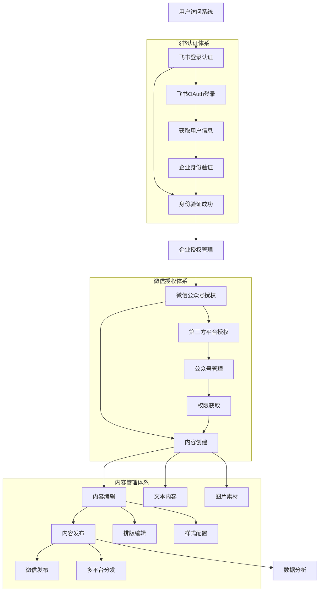
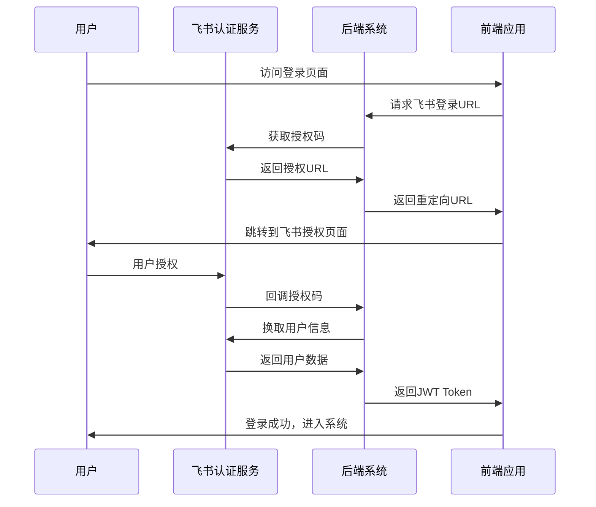
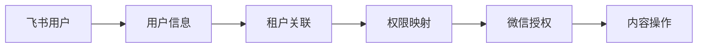
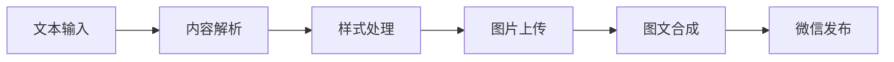

# 完整业务流程梳理：飞书登录 → 企业微信授权 → 内容管理

## 🎯 业务概述

这是一个企业级内容管理平台，通过飞书身份认证，整合微信公众号管理，实现内容创建、编辑、发布的完整工作流。

## 🔄 完整流程图



## 📋 详细业务流程

### 1. 飞书登录认证流程

#### 1.1 初始访问
- **入口**: 用户访问 `http://localhost:1921`
- **组件**: `UserConfig.vue`, `LoginCallback.vue`
- **API**: `/api/auth/feishu/login`

#### 1.2 飞书OAuth认证


#### 1.3 企业身份验证
- **组件**: `TenantSelect.vue`
- **功能**:
  - 获取企业信息
  - 验证用户权限
  - 设置租户上下文

### 2. 企业授权管理

#### 2.1 租户管理
- **组件**: `UserConfig.vue`
- **API**: `/api/tenants`
- **功能**:
  - 创建/管理租户
  - 用户权限分配
  - 企业配置设置

#### 2.2 微信公众号授权
- **组件**: `WechatAuthManager.vue`
- **服务**: `ThirdPartyWechatAuth.ts`
- **流程**:
  1. 企业管理员发起授权
  2. 生成微信开放平台授权链接
  3. 公众号管理员扫码授权
  4. 获取完整管理权限
  5. 自动管理token刷新

### 3. 内容创建流程

#### 3.1 文本内容处理
- **组件**: `Step1TextInput.vue`
- **工具**: `textParser.ts`
- **功能**:
  - 文本输入和解析
  - 格式化处理
  - 内容预览

#### 3.2 样式配置
- **组件**: `StyleConfig.vue`, `Step2Curtain.vue`
- **工具**: `styleAssembler.ts`
- **功能**:
  - 模板选择
  - 样式自定义
  - 实时预览

#### 3.3 图片素材管理
- **组件**: `WechatImageUploader.vue`
- **API**: `/api/wechat/upload`
- **功能**:
  - 图片上传到微信
  - 获取media_id
  - 批量处理

### 4. 内容编辑流程

#### 4.1 排版编辑
- **组件**: `Step3Preview.vue`
- **功能**:
  - 可视化编辑
  - 样式调整
  - 实时预览

#### 4.2 高级编辑
- **组件**: `LayoutInserter.vue`, `DraftPreview.vue`
- **功能**:
  - 布局插入
  - HTML编辑
  - 批量操作

### 5. 内容发布流程

#### 5.1 微信发布
- **组件**: `ArticleConfig.vue`
- **API**: `/api/articles/:id/publish`
- **流程**:
  1. 创建图文草稿
  2. 上传图片素材
  3. 配置发布参数
  4. 发布到微信公众号

#### 5.2 多平台分发（未来扩展）
- 飞书文档
- 企业微信
- 其他社交媒体平台

## 🔧 技术架构

### 前端架构 (Vue 3 + Vite)
```
src/
├── components/          # 可复用组件
│   ├── WechatAuthManager.vue      # 微信授权管理
│   ├── WechatImageUploader.vue   # 微信图片上传
│   ├── StyleSelector.vue         # 样式选择器
│   └── ...
├── views/              # 页面组件
│   ├── UserConfig.vue            # 用户配置
│   ├── Step1TextInput.vue        # 文本输入
│   ├── Step2Curtain.vue          # 样式配置
│   ├── Step3Preview.vue          # 内容预览
│   └── ...
├── services/           # 业务服务
│   ├── ThirdPartyWechatAuth.ts   # 微信授权服务
│   ├── wechatService.ts          # 微信API服务
│   └── ...
├── stores/             # 状态管理
│   ├── appStore.ts               # 应用状态
│   └── userStore.ts              # 用户状态
└── utils/              # 工具函数
    ├── api.ts                    # API调用
    ├── textParser.ts             # 文本解析
    └── ...
```

### 后端架构 (NestJS + PostgreSQL)
```
content-backend/src/
├── modules/            # 模块
│   ├── auth/                     # 认证模块
│   │   ├── auth.controller.ts
│   │   ├── auth.service.ts
│   │   └── feishu/               # 飞书认证
│   ├── wechat/                   # 微信模块
│   │   ├── wechat.controller.ts
│   │   ├── wechat.service.ts
│   │   └── third-party/          # 第三方授权
│   ├── articles/                 # 文章模块
│   ├── tenants/                  # 租户模块
│   └── ...
├── entities/           # 数据实体
├── migrations/         # 数据库迁移
└── config/             # 配置文件
```

## 🔐 安全机制

### 1. 认证授权
- **飞书OAuth 2.0**: 企业级身份认证
- **JWT Token**: 会话管理
- **RBAC权限控制**: 基于角色的访问控制

### 2. 微信授权安全
- **第三方平台授权**: 官方授权机制
- **Token自动刷新**: 防止过期
- **HTTPS传输**: 加密数据传输

### 3. 数据安全
- **敏感信息加密**: 存储加密
- **API鉴权**: 接口权限控制
- **审计日志**: 操作记录追踪

## 📊 数据流程

### 用户数据流


### 内容数据流


## 🎯 核心价值

### 1. 企业级集成
- 统一的飞书身份认证
- 企业级权限管理
- 多租户支持

### 2. 微信生态整合
- 官方第三方授权
- 无缝API集成
- 自动化管理

### 3. 内容生产提效
- 可视化编辑
- 模板化生产
- 批量操作

### 4. 安全合规
- 企业级安全标准
- 官方授权机制
- 数据保护合规

## 🚀 部署流程

### 1. 环境准备
- 飞书开放平台应用
- 微信开放平台第三方应用
- PostgreSQL数据库
- Redis缓存（可选）

### 2. 配置部署
- 环境变量配置
- 数据库迁移
- 服务启动
- 域名配置

### 3. 监控运维
- 日志收集
- 性能监控
- 错误追踪
- 数据备份

这个完整的业务流程确保了从用户认证到内容发布的全链路管理，为企业提供了专业、安全、高效的微信内容管理解决方案。