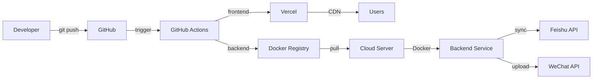

# 现代化部署方案研究

## 一、部署方案对比

### 1. 传统部署 vs 容器化 vs Serverless

| 方案 | 优势 | 劣势 | 适用场景 |
|------|------|------|----------|
| **传统部署** | • 简单直接<br>• 无学习成本<br>• 调试方便 | • 环境不一致<br>• 扩容困难<br>• 资源利用率低 | • 快速原型<br>• 简单项目 |
| **容器化部署** | • 环境一致性<br>• 快速扩缩容<br>• 资源利用率高 | • 有学习成本<br>• 需要额外层<br>• 存储复杂 | • 微服务<br>• 多环境部署 |
| **Serverless** | • 按量付费<br>• 零运维<br>• 自动扩容 | • 冷启动<br>• 执行限制<br>• 厂商锁定 | • 事件驱动<br>• 波动流量 |

### 2. 针对您项目的建议

**前端 (Vue 3)**
- ✅ **推荐：Vercel/Netlify**
  - 免费 CDN
  - 自动优化
  - 零配置部署

**后端 (Node.js)**
- ✅ **推荐：Docker + 云服务器**
  - 完全控制权
  - 成本可控
  - 易于维护

## 二、CI/CD 自动化部署

### GitHub Actions 工作流示例

#### 前端部署到 Vercel

```yaml
# .github/workflows/deploy-frontend.yml
name: Deploy Frontend

on:
  push:
    branches: [ main ]
    paths: [ 'src/**', 'public/**', 'package.json' ]

env:
  VERCEL_ORG_ID: ${{ secrets.ORG_ID }}
  VERCEL_PROJECT_ID: ${{ secrets.PROJECT_ID }}

jobs:
  deploy:
    runs-on: ubuntu-latest
    steps:
    - name: Checkout
      uses: actions/checkout@v4

    - name: Setup Node.js
      uses: actions/setup-node@v4
      with:
        node-version: '18'
        cache: 'npm'
        cache-dependency-path: src/package-lock.json

    - name: Install dependencies
      run: |
        cd src
        npm ci

    - name: Type check
      run: |
        cd src
        npm run type-check

    - name: Build
      run: |
        cd src
        npm run build

    - name: Deploy to Vercel
      uses: vercel/action@v1
      with:
        vercel-token: ${{ secrets.VERCEL_TOKEN }}
        vercel-org-id: ${{ secrets.ORG_ID }}
        vercel-project-id: ${{ secrets.PROJECT_ID }}
        vercel-args: '--prod'
```

#### 后端部署到云服务器

```yaml
# .github/workflows/deploy-backend.yml
name: Deploy Backend

on:
  push:
    branches: [ main ]
    paths: [ 'backend/**' ]

jobs:
  deploy:
    runs-on: ubuntu-latest
    steps:
    - name: Checkout
      uses: actions/checkout@v4

    - name: Deploy to server
      uses: appleboy/ssh-action@v1.0.0
      with:
        host: 101.42.158.32
        username: root
        key: ${{ secrets.SSH_PRIVATE_KEY }}
        script: |
          cd /root/content-backend
          git pull origin main
          npm install --production
          pm2 reload content-backend
```

### 环境变量管理

使用 `.env.example` 文件：

```bash
# .env.example
NODE_ENV=production
PORT=3001
DATA_DIR=/var/www/content-backend/data

# 飞书配置
FEISHU_APP_ID=your_app_id
FEISHU_APP_SECRET=your_app_secret
FEISHU_VERIFICATION_TOKEN=your_token

# API 配置
API_BASE_URL=https://api.lx05.art
```

## 三、容器化部署方案

### 1. Dockerfile 优化

```dockerfile
# 多阶段构建 - 后端
FROM node:18-alpine AS builder

WORKDIR /app
COPY package*.json ./
RUN npm ci --only=production && npm cache clean --force

# 生产镜像
FROM node:18-alpine AS runner

RUN addgroup -g 1001 -S nodejs
RUN adduser -S backend -u 1001

WORKDIR /app

COPY --from=builder /app/node_modules ./node_modules
COPY --chown=backend:nodejs . .

USER backend

EXPOSE 3001

CMD ["node", "src/app.js"]

# 健康检查
HEALTHCHECK --interval=30s --timeout=3s --start-period=5s --retries=3 \
  CMD curl -f http://localhost:3001/health || exit 1
```

### 2. Docker Compose

```yaml
# docker-compose.yml
version: '3.8'

services:
  backend:
    build:
      context: .
      dockerfile: Dockerfile
    ports:
      - "3001:3001"
    volumes:
      - ./data:/app/data
      - ./logs:/app/logs
    environment:
      - NODE_ENV=production
    restart: unless-stopped
    healthcheck:
      test: ["CMD", "curl", "-f", "http://localhost:3001/health"]
      interval: 30s
      timeout: 10s
      retries: 3
      start_period: 40s

  nginx:
    image: nginx:alpine
    ports:
      - "80:80"
      - "443:443"
    volumes:
      - ./nginx.conf:/etc/nginx/nginx.conf
      - ./ssl:/etc/nginx/ssl
    depends_on:
      - backend
    restart: unless-stopped
```

### 3. 零停机滚动更新脚本

```bash
#!/bin/bash
# deploy.sh - 零停机部署脚本

set -e

# 配置
PROJECT_NAME="content-backend"
DOCKER_IMAGE="$PROJECT_NAME:latest"
CONTAINER_NAME="backend"
HEALTH_CHECK_URL="http://localhost:3001/health"

# 颜色输出
GREEN='\033[0;32m'
RED='\033[0;31m'
YELLOW='\033[1;33m'
NC='\033[0m'

log() {
    echo -e "${GREEN}[$(date +'%Y-%m-%d %H:%M:%S')] $1${NC}"
}

warn() {
    echo -e "${YELLOW}[$(date +'%Y-%m-%d %H:%M:%S')] $1${NC}"
}

error() {
    echo -e "${RED}[$(date +'%Y-%m-%d %H:%M:%S')] $1${NC}"
}

# 健康检查
health_check() {
    local url=$1
    local max_attempts=30
    local attempt=0

    while [ $attempt -lt $max_attempts ]; do
        if curl -f -s "$url" > /dev/null; then
            log "Health check passed"
            return 0
        fi
        warn "Health check failed... ($attempt/$max_attempts)"
        sleep 2
        attempt=$((attempt + 1))
    done

    error "Health check failed after $max_attempts attempts"
    return 1
}

# 部署流程
log "Starting zero-downtime deployment..."

# 1. 拉取最新代码
log "Pulling latest code..."
git pull origin main

# 2. 构建新镜像
log "Building new Docker image..."
docker build -t "$DOCKER_IMAGE" .

# 3. 停止旧容器（如果存在）
if [ $(docker ps -q -f name=$CONTAINER_NAME) ]; then
    log "Stopping old container..."
    docker stop $CONTAINER_NAME
fi

# 4. 启动新容器
log "Starting new container..."
docker run -d \
    --name $CONTAINER_NAME \
    --restart unless-stopped \
    -p 3001:3001 \
    -v $(pwd)/data:/app/data \
    -e NODE_ENV=production \
    $DOCKER_IMAGE

# 5. 等待健康检查
if health_check "$HEALTH_CHECK_URL"; then
    log "✅ Deployment successful!"

    # 6. 清理旧镜像
    docker image prune -f

    # 7. 发送通知
    # send_notification "Deployment successful"
else
    error "❌ Deployment failed!"

    # 回滚
    docker stop $CONTAINER_NAME
    docker run -d \
        --name $CONTAINER_NAME \
        --restart unless-stopped \
        -p 3001:3001 \
        -v $(pwd)/data:/app/data \
        -e NODE_ENV=production \
        content-backend:previous

    exit 1
fi
```

## 四、Serverless 部署方案

### 1. Vercel Serverless Functions

```javascript
// api/webhook.js
export default async function handler(req, res) {
  if (req.method !== 'POST') {
    return res.status(405).json({ error: 'Method not allowed' });
  }

  try {
    const { event, data } = req.body;

    // 处理 webhook 事件
    switch (event) {
      case 'content_created':
        await handleContentCreated(data);
        break;
      case 'content_updated':
        await handleContentUpdated(data);
        break;
      default:
        return res.status(400).json({ error: 'Unknown event' });
    }

    res.status(200).json({ success: true });
  } catch (error) {
    console.error('Webhook error:', error);
    res.status(500).json({ error: 'Internal server error' });
  }
}
```

### 2. 腾讯云函数 SCF

```yaml
# serverless.yml
service: content-backend

provider:
  name: tencent
  runtime: Nodejs16.14
  region: ap-guangzhou
  memorySize: 256
  timeout: 30

functions:
  webhook:
    handler: webhook.main
    events:
      - apigw:
          path: /webhook
          method: POST
    environment:
      NODE_ENV: production
```

## 五、推荐部署架构

### 基于您项目的最佳实践



### 具体实施步骤

#### 第一阶段：基础自动化（1周）

1. **前端迁移到 Vercel**
   ```bash
   # 安装 Vercel CLI
   npm i -g vercel

   # 部署
   vercel --prod
   ```

2. **后端 Docker 化**
   ```bash
   # 创建 Dockerfile
   # 构建镜像
   docker build -t content-backend .

   # 运行容器
   docker run -d -p 3001:3001 content-backend
   ```

3. **配置 GitHub Actions**
   - 创建工作流文件
   - 配置 secrets
   - 测试自动部署

#### 第二阶段：优化提升（1周）

1. **添加测试**
   ```yaml
   - name: Run tests
     run: npm test

   - name: E2E test
     run: npm run test:e2e
   ```

2. **监控告警**
   - Uptime 监控
   - 错误追踪
   - 性能监控

3. **自动回滚**
   ```yaml
   - name: Rollback on failure
     if: failure()
     run: |
       # 回滚到上一个版本
       vercel rollback [deployment-id]
   ```

#### 第三阶段：高级特性（2周）

1. **蓝绿部署**
   - 配置负载均衡
   - 实现无缝切换

2. **灰度发布**
   - 百分比流量控制
   - A/B 测试

3. **自动化运维**
   - 自动扩容
   - 自动备份
   - 自动清理

## 六、成本分析

| 方案 | 月成本 | 优点 | 缺点 |
|------|--------|------|------|
| **当前手动部署** | ¥30 (服务器) | • 简单<br>• 无学习成本 | • 耗时<br>• 易出错 |
| **GitHub Actions + Vercel** | ¥30 + ¥0 = ¥30 | • 自动化<br>• 稳定可靠 | • 有学习成本 |
| **Kubernetes** | ¥100+ | • 高可用<br>• 弹性伸缩 | • 复杂<br>• 成本高 |
| **完全 Serverless** | ¥0-50 | • 按量付费<br>• 零运维 | • 厂商锁定<br>• 限制多 |

## 七、决策建议

对于您的情况（1-2人团队），我推荐：

### 立即实施

1. **前端 → Vercel**
   - 免费 CDN
   - 自动优化
   - 全球加速

2. **后端 → Docker + 当前服务器**
   - 保持现有服务器
   - 添加容器化
   - GitHub Actions 自动化

### 未来考虑

- 访问量增长 → 考虑负载均衡
- 功能复杂 → 微服务拆分
- 团队扩大 → Kubernetes

### 避免的坑

1. **不要过度工程化**
   - 简单项目用简单方案

2. **不要一开始就用 K8s**
   - 学习成本高，维护复杂

3. **不要忽视监控**
   - 出问题才发现就晚了

4. **文档要同步更新**
   - 避免"只有一个人懂部署"

## 八、快速迁移指南

### 1. 前端迁移到 Vercel（30分钟）

```bash
# 1. 安装 Vercel CLI
npm i -g vercel

# 2. 登录
vercel login

# 3. 部署
cd src
vercel --prod

# 4. 配置自定义域名
vercel --prod
vercel domains add layout.lx05.art
```

### 2. 后端 Docker 化（1小时）

```bash
# 1. 创建 Dockerfile
# 2. 构建镜像
docker build -t content-backend .

# 3. 测试运行
docker run -p 3001:3001 content-backend

# 4. 替换现有部署
# 参考 docker-compose.yml
```

### 3. 设置 GitHub Actions（15分钟）

```bash
# 1. 创建 .github/workflows 目录
mkdir -p .github/workflows

# 2. 添加工作流文件
# 3. 配置 secrets
# 4. 测试推送
```

这套现代化部署方案将大大提升您的开发效率和部署可靠性，同时成本增加有限。